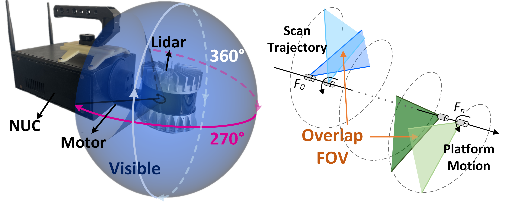
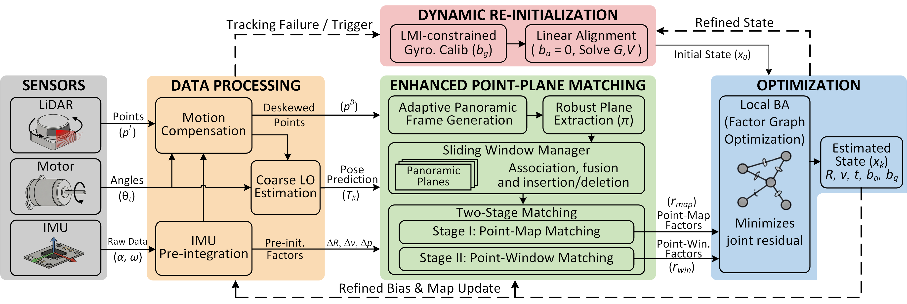
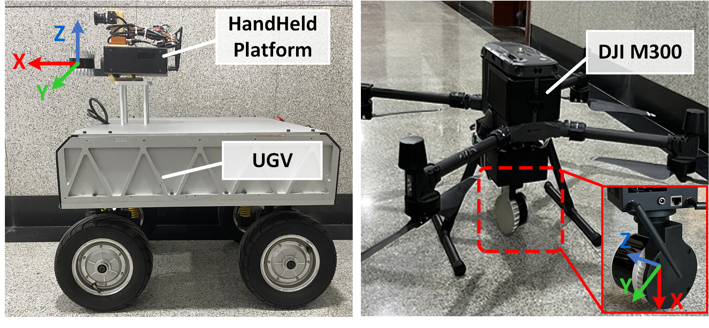

# LiDAR-Inertial Odometry for Self-built Panoramic LiDAR With Dynamic Re-Initialization and Enhanced Point-Plane Matching

**[Work in Progress]** This repository contains the implementation of the LIO framework tailored for our **self-built panoramic LiDAR system**.

> **📢 NOTICE:** The source code will be made publicly available upon the acceptance of our paper.
>
> If you are a reviewer, thank you for your time and interest!

---

### 1. Introduction

This project proposes a robust LiDAR-Inertial Odometry (LIO) framework specifically designed for a **self-built panoramic LiDAR** (spinning 32-line LiDAR). Unlike conventional LIO systems, our device generates an ultra-wide FOV ($360^\circ \times 270^\circ$) but suffers from **extremely low inter-frame overlap** and aggressive rotational motion.

To address these challenges, our system features:
* **Dynamic Re-Initialization:** Capable of recovering from tracking failures *on-the-fly* while the LiDAR is continuously rotating, without requiring a static phase.
* **Enhanced Point-Plane Matching (EPPM):** Exploits historical planar information via a sliding window manager to supplement local constraints in low-overlap scenarios.

<p align="center">
  
</p>
<p align="center">
    <em>Fig. 1. Our self-built handheld panoramic LiDAR system.</em>
</p>

<br>

<p align="center">
  
</p>
<p align="center">
    <em>Fig. 2. The proposed system framework.</em>
</p>

### 2. Key Features

- **Hardware Adaptation:** Tightly coupled LIO tailored for self-built panoramic LiDAR (coupling of motor rotation and platform motion).
- **Dynamic Re-initialization:**
    - LMI-constrained gyroscope bias calibration.
    - Linear alignment for gravity and velocity estimation under high-speed rotation.
- **Enhanced Point-Plane Matching (EPPM):**
    - **Sliding Window Manager:** Propagates historical planar structures into currently unobserved regions to address the low inter-frame overlap.
    - **Two-Stage Matching:** fuses point-map constraints with point-window constraints to ensure tracking stability in narrow or degenerate environments.
- **Accuracy:** Outperforms SOTA methods (FAST-LIO2, iG-LIO, etc.) in aggressive motion and unstructured environments.
- **Versatility:** Validated on **Handheld**, **UGV**, and **UAV** platforms.

<p align="center">
  
</p>
<p align="center">
    <em>Fig. 3. Experimental platforms used for evaluation.</em>
</p>


### 3. Build & Run (Coming Soon)

#### Prerequisites
* Ubuntu 20.04
* ROS Noetic
* PCL >= 1.8
* Eigen >= 3.3.4

#### Compilation
```bash
cd ~/catkin_ws/src
git clone [https://github.com/YourUsername/RepoName.git](https://github.com/YourUsername/RepoName.git)
cd ..
catkin_make
source devel/setup.bash
```

### 4. Experimental Results

We evaluated our framework on the **DUT-Indoor** dataset and the **DUT-Outdoor** dataset against state-of-the-art LIO systems, including **LIO-SAM**, **FAST-LIO**, **FASTER-LIO**, **POINT-LIO**, and **IG-LIO**.

**In addition, we conducted a detailed comparative study between our Dynamic Re-initialization module and the D-LI-Init method.** The results demonstrate that our method achieves superior stability and accuracy in estimating system states (velocity, gravity, IMU biases) under continuous rotation.

The proposed method demonstrates superior accuracy and robustness, especially in sequences with aggressive rotation and low overlap. **Detailed qualitative and quantitative comparisons, along with ablation studies, are presented in the paper.**


### 5. Acknowledgements

We thank the authors of LIO-SAM, FAST-LIO, FASTER-LIO, POINT-LIO, IG-LIO and D-LI-Init for their open-source contributions.

---

**Maintainer:** Wenzhe Yang (ywz@mail.dlut.edu.cn)


